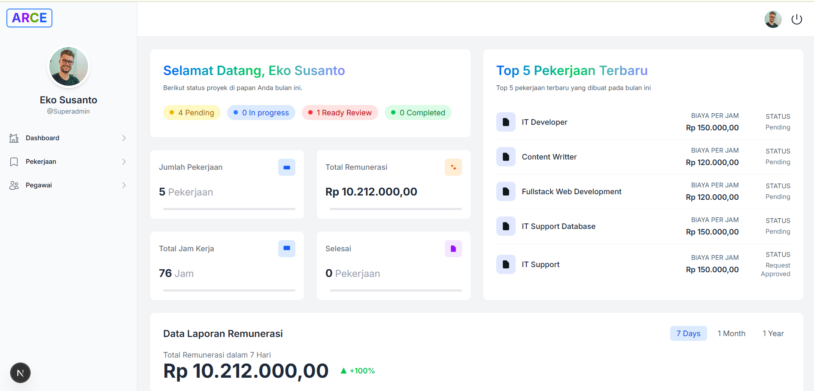
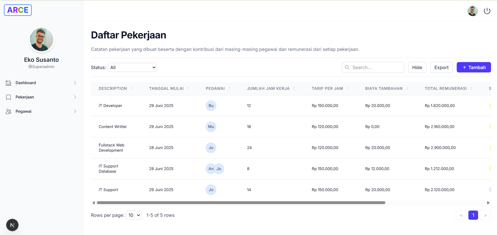
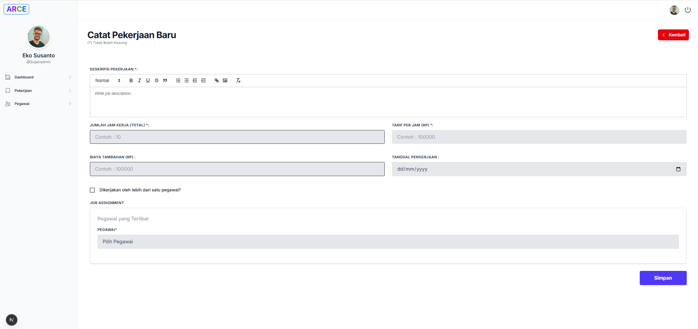
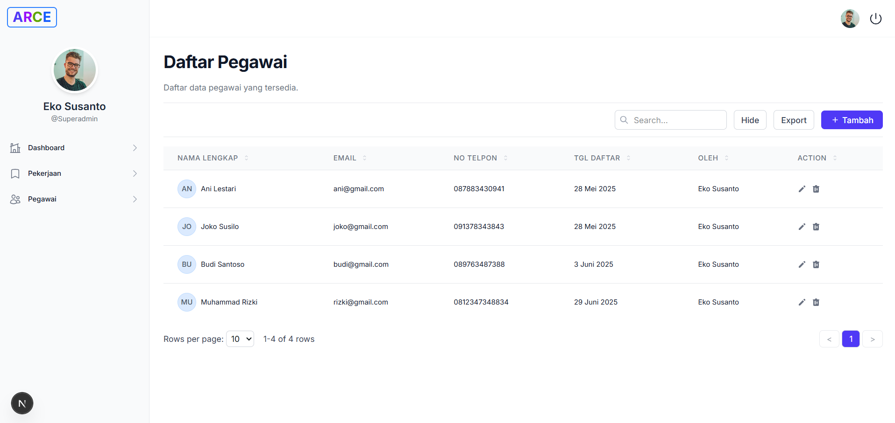
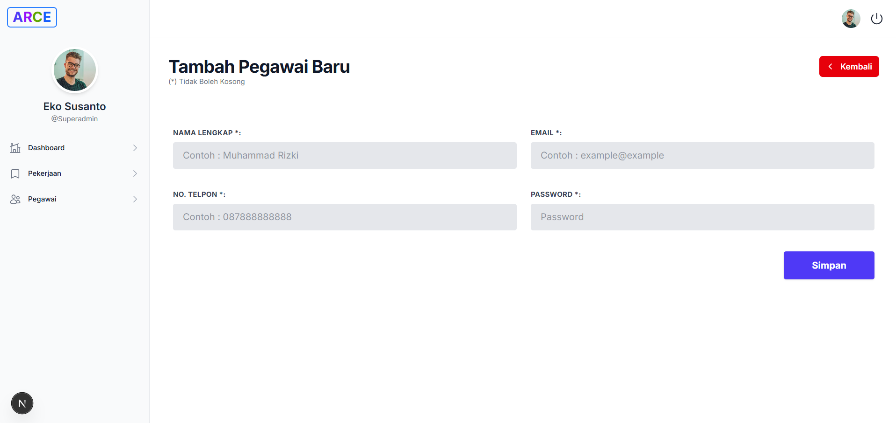

# 💼 Aplikasi Remunerasi Pegawai

📊 **Aplikasi Remunerasi Pegawai** adalah sistem berbasis web yang dirancang untuk membantu proses pengelolaan gaji, tunjangan, dan insentif pegawai di lingkungan organisasi atau instansi. Aplikasi ini dibuat dengan pendekatan sederhana namun fleksibel, menggunakan **PHP** dan **MySQL**.

---


## 🚀 Fitur Utama

- ✅ **Manajemen Data Pegawai** – Tambah, edit, dan hapus data karyawan dengan mudah.
- 💸 **Perhitungan Remunerasi** – Hitung gaji, tunjangan, dan potongan secara otomatis berdasarkan input dan aturan organisasi.
- 📆 **Periode Pembayaran** – Pengelolaan periode pembayaran berdasarkan jumlah jam kerja.
- 📄 **Laporan & Rekapitulasi** – Cetak laporan gaji dan riwayat pembayaran dalam format yang rapi.
- 🔐 **Login Multi-Level** – Akses sistem berdasarkan level pengguna (admin,HRD, keuangan, pegawai).

## 🛠️ Teknologi yang Digunakan

- **Bahasa Pemrograman**: PHP
- **Basis Data**: MySQL
- **Framework/CMS**: Laravel v12.16.0
- **Frontend**: HTML, CSS, JavaScript
- **Lainnya**: Tailwind

## 🛠️ Alur kerja dan Instalansi 
- Arsitektur solusi 
- Penjelasan desain
- Setup & deploy lengkap
- Tantangan & solusi

---


## 🧠 Arsitektur Solusi

Berikut adalah alur kerja data dari frontend ke backend:

```
[User Interface - Browser]
        ↓
[PHP Controller/Router]
        ↓
[Business Logic - Perhitungan Remunerasi]
        ↓
[Database (MySQL)]
        ↑
  (Data Pegawai, Gaji, Tunjangan)
```

> Pengguna mengakses aplikasi melalui antarmuka web. Data yang dimasukkan akan diproses di sisi backend (PHP), termasuk perhitungan remunerasi berdasarkan input tertentu. Hasil akhir ditampilkan kembali di UI dan juga disimpan di basis data untuk pelaporan atau pengolahan selanjutnya.

---

## 🎨 Penjelasan Desain

- **Kenapa PHP + MySQL?**  
  Dipilih karena stabil, mudah dipahami, dan banyak digunakan di lingkungan organisasi dan pendidikan di Indonesia.

- **Modularitas & Keamanan**  
  Setiap modul (pegawai, gaji, tunjangan) dibuat terpisah agar mudah dikembangkan dan dipelihara. Validasi input dan kontrol akses berbasis level pengguna juga diterapkan untuk menjaga integritas data.

- **Integrasi Perhitungan Remunerasi**  
  Logika perhitungan gaji dan tunjangan ditulis langsung di backend (PHP). Proses ini mencakup:
  - Penjumlahan gaji pokok + tunjangan tetap + insentif
  - Pengurangan pajak atau potongan lainnya
  - Penyimpanan hasil ke tabel rekap gaji bulanan

---

## 🛠️ Setup & Deploy

### 📦 Instalasi Lokal

1. **Clone repositori:**

```bash
git clone https://github.com/echoTech187/aplikasi-remunerasi-pegawai.git
```

2. **Buat database baru:**

- Buka `phpMyAdmin`
- Buat database misalnya `remunerasi_pegawai`
- Impor file `.sql` dari folder `/database`

3. **Konfigurasi koneksi database:**

- Buka file `config/koneksi.php` (atau sesuai struktur repo)
- Sesuaikan:

```php
$host = "localhost";
$user = "root";
$pass = "";
$db   = "remunerasi_pegawai";
```

4. **Jalankan server lokal:**

- Gunakan `XAMPP`, `Laragon`, atau `MAMP`
- Akses melalui: `http://localhost/aplikasi-remunerasi-pegawai`

---

## ⚙️ Konfigurasi Environment

Tidak ada dependensi eksternal berbasis Composer (jika ada, tambahkan di sini). Pastikan PHP dan MySQL aktif, serta Apache berjalan di lokal.

```bash
PHP >= 7.2
MySQL >= 5.6
Apache2
```

---

## 📉 Tantangan & Solusi

| Tantangan | Solusi yang Diterapkan |
|----------|--------------------------|
| 🔄 Menyesuaikan skema perhitungan remunerasi yang berbeda di tiap organisasi | Dibuat sistem yang fleksibel, dengan parameter yang bisa disesuaikan melalui pengaturan backend |
| 🧩 Validasi input data pegawai agar tidak terjadi duplikasi | Ditambahkan pengecekan NIP dan email unik saat input data |
| 🔒 Akses multi-level dengan hak pengguna berbeda | Sistem login dengan peran (role-based access control) seperti admin, HRD, keuangan |
| 📋 Format laporan yang rapi dan siap cetak | Menggunakan HTML yang sudah diatur untuk layout cetak langsung dari browser |

---

## 👥 Hak Akses Pengguna

| Role     | Akses                                                                 |
|----------|-----------------------------------------------------------------------|
| Admin    | Kelola semua data, pengguna, laporan                                 |
| HRD      | Kelola data pegawai dan informasi remunerasi                         |
| Keuangan | Lihat laporan dan melakukan rekapitulasi pembayaran                  |
| Pegawai  | Lihat data pribadi dan slip gaji masing-masing                       |

---

## 📷 Tampilan Antarmuka








---

## 🤝 Kontribusi

Kami terbuka untuk kontribusi dari pengembang lain! Jika Anda ingin membantu:

1. Fork repositori ini
2. Buat branch fitur baru: `git checkout -b fitur-anda`
3. Commit perubahan: `git commit -m 'Tambah fitur X'`
4. Push ke branch Anda: `git push origin fitur-anda`
5. Buka Pull Request 🚀

---

## 📄 Lisensi

Proyek ini dilisensikan di bawah **MIT License**.  
Silakan lihat file [LICENSE](LICENSE) untuk detailnya.

---

## 📬 Kontak Developer

Untuk pertanyaan, kolaborasi, atau pelaporan bug:

- 📧 Email: **echoTech187@gmail.com**
- 🔗 GitHub: [echoTech187](https://github.com/echoTech187)

---
